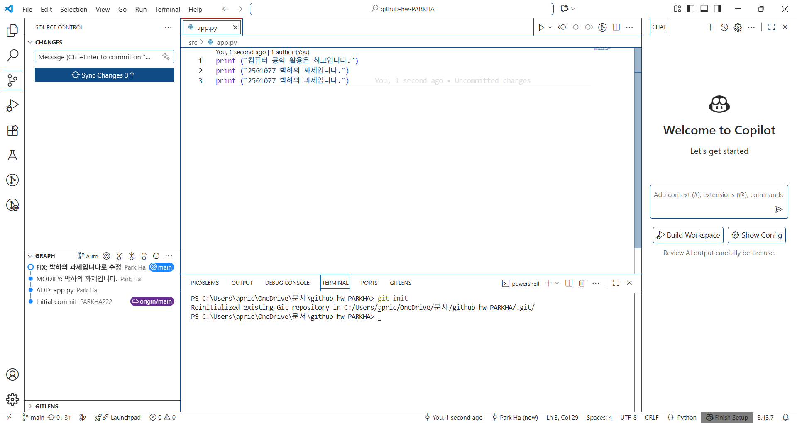

# github-hw-PARKHA

# VS Code에서 Python 프로젝트를 생성

# 1. 첫 번째 commit: src/app.py 작성 ADD [컴퓨터 공학 활용은 최고입니다.]
# 2. 두 번째 commit: MODIFY: [2501077 박하의 꽈제입니다.]
# 3. 세 번째 commit: FIX: [2501077 박하의 과제입니다로 수정]

# 4. [첫 번째 캡처]: (doc/images/capture1.png)

# 4. [두 번째 캡처]: (doc/images/capture2.png)

# 5. git@github.com:PARKHA222/github-hw-PARKHA.git

# 6. 이 과제를 하며 느낀 점: 이번 과제는 VS Code에서 Python 프로젝트를 생성하고
# Git / GitHub를 활용하여 버전 관리 및 저장소를 연동하는 과정이었습니다.
# 이번 과제를 하며 폴더의 구조를 이해하고 push와 pull의 역할에 대해 복습할 수 있었습니다.
# Git/Git Hub를 하며 어려웠던 점은 실수 했을 때 변경하거나 되돌리는 것이 어려웠습니다.
# 특히 커밋을 되돌려도 흔적이 남아 헷갈리는 경우도 많았던 것 같습니다.
# 앞으로 더 해보고 싶은 것은 HEAD와 master에 대해 더 자세히 알아보는 것입니다!
